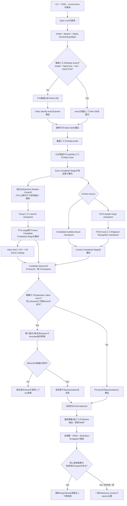
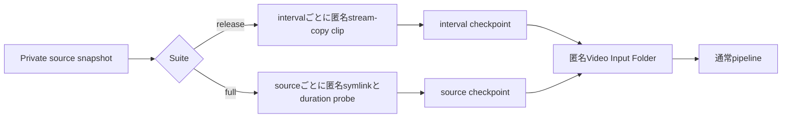
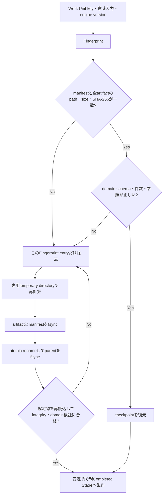

# Pipelineと安全な再開

この文書は、動画入力pipelineの処理順、永続checkpoint、依存変更時の再計算範囲、
再開前後で変えてはいけないoutputを定義します。通常実行は常に再開可能で、
`--resume`はありません。同じcommandを再実行します。

## 再開の不変条件

- 完了した最小Work Unitは、process、WSL2、Windowsの再起動後も再利用します。
- runtime、model、設定、algorithmの変更は、その値を意味入力に持つWork Unitまたは
  Completed Stageと、そのdownstreamだけを失効させます。
- 同じ意味入力から再開した場合、選択Candidate ID、選択順、公開WebP bytes、
  canonical reportの意味内容を中断なしの実行と一致させます。
- worker数、完了順、attempt時刻、経過時間、resource sample、cache件数などの運用診断を
  semantic identityへ混ぜません。
- hash整合だけでなくdomain schemaと参照関係も検証します。破損した対象だけを削除して
  再計算し、健全な兄弟Work Unitは保持します。
- 権限不足、一時的なmount切断、I/O access failureは破損と区別します。読めない成果物を
  削除・置換せず、その場で失敗して同じ状態から再開可能にします。
- Output Folderへのatomic renameが完了していれば、その直後にprocessが終了しても
  完成済みoutputを再検証し、意味結果が一致する場合は一byteも変更せず再利用します。

## 通常pipelineの処理順



Embedded SubtitleとSTTを強制併用する設定では、両方のbranchを処理します。
Scene CatalogはPrimary Representative Frameに依存し、Candidate AnnotationはCatalog、
一枚のFrame Candidate、必要なContext Cueへ依存します。したがってSTT変更はCatalogを
失効させず、Annotation以降だけへ伝播します。Combat Representative Fallbackの兄弟frameは
それぞれ独立したCompleted Stageであり、並列完了順ではなく元のframe順で集約します。

Video Scanはcold runと再開runの両方で同じ15分固定partitionを使います。streamに
`duration_ts`がない場合だけ、ffprobeのcontainer durationを有理数としてstream tickへ
切り上げ、完全な15分区間の境界を決めます。このhintをVideo Durationやframe時刻には
使いません。15分未満の端数は独立partitionにせず、最後のpartitionを直前の境界から
EOFまで開くことで、probeの丸めによる末尾frameの欠落と空partitionの必須化を防ぎます。
別streamの長いtailにより完全な15分境界まで過大評価された場合は、最初の空partitionも
checkpointへ確定し、同じ開始PTSからEOFまでを一度だけ確認します。EOF確認も空なら後続境界を
処理せず、後半frameがあればtimestamp gapとしてそのtailを最終partitionへ保持します。
並列workerの完了順ではなくVideo OrderとWork Unit keyの安定順で集約します。

Video Order上の各Video Stageは従来どおり順番に確定します。その内側で、互いに離れた
Refinement Window Groupだけを、Video Scanと共有するlogical CPU容量、available memory、最大4の
safe capに従って並列処理します。RefinementのCPU予約中は後続scanの投入も残り容量へ制限し、
余力がなければscan完了を待ちます。memoryを取得できない場合は1 workerへ抑制します。
各Groupは別々のDurable Work Unitなので、cache hitはdecodeせず、失敗・破損・中断した
Groupだけを次回再計算します。worker数、開始順、完了順はfingerprintへ含めず、結果をPTS
range順へ戻してから親Stageを作るため、再開やresource量によって意味outputは変わりません。
処理ごとの主な計算資源は[Pipeline処理フローと計算資源](processing-flow.md)にまとめています。

## Target Acceptanceのmaterialization



完成済みmaterialization manifestは、sourceのsize・mtimeと生成済みartifactを再検証して
終端成果物として再利用します。未完成materializationは一つのMedia Runtime Identityへ
固定します。各interval/source checkpoint自身が確定時のMedia Runtime Identityを持つため、
contextが欠損・破損しても完成済みunitを保持できます。identityが途中で変わった場合は、
安定したunit順に旧identityのunitだけを現在identityで置き換えます。途中で再び停止しても、
置換済みunitを次回再利用し、まだ旧identityのunitだけを続行します。全unitが現在identityへ
揃うまで終端manifestを公開しないため、旧・新runtimeの混在はoutputへ到達しません。
置換では新artifactとpending checkpointを先に検証・永続化し、固定名をatomicに切り替えた後で
pendingをcommit markerへ昇格します。どの命令間で電源断しても、旧checkpoint、pending、
新checkpointのいずれかが固定名artifactを証明するため、完了済みunitへ戻れます。
通常pipelineのVideo Identity、Scan、STTなど別cacheを全削除する理由にはしません。
終端manifestが欠損・破損しても、健全なinterval/source checkpointからdescriptorを
現在runtimeのprobeより先に再構築します。したがって完成済みmaterializationは、その後の
FFmpeg更新だけを理由に再生成しません。
未完成materializationのcontextが欠損・破損した場合はcontextだけを再構築し、unitごとの
checkpointに記録されたidentityとartifactを検証します。

## checkpointの確定と修復



同じfingerprint専用のfile lock内で一度だけ生成します。認識できる同fingerprintの
temporary entryだけを掃除し、未知のdirectoryや別fingerprintへ触れません。親Completed
Stageもartifactとmanifestを同じ方法で検証します。親だけが欠損・破損している場合は、
健全な子Work Unitから親を再集約します。

## 永続化する最小単位

| 処理 | 最小の永続単位 | 中断後に失う処理 |
|---|---|---|
| Release materialization | 指定interval 1件 | 作成中だったclip 1件。同runtimeの確定clipは保持 |
| Full materialization | source 1本のsymlinkとduration | probe中だったsource 1本 |
| Video Identity | 動画1本 | hash中だった1本のSHA-256 |
| Video Scan | 15分のPTS partition | decode中だった1 partition |
| Frame Candidate Extraction | merge済みRefinement Window Group | 実行中だった各group。未開始groupは処理量の損失なし、確定済み兄弟groupは保持 |
| Embedded Subtitle | 選択subtitle stream 1本 | 抽出中だったstream |
| PCM Extraction | 固定sample range 1件 | 抽出中だったrange |
| Speech Recognition | overlapを含むPCM chunk 1件 | 推論中だったchunk |
| Scene Catalog | Video Setにつき1 model request | 実行中だったrequest |
| Candidate Annotation | 評価対象のFrame Candidate 1枚 | 推論中だった1枚。確定済み兄弟frameは保持 |
| Final Selection | Video Setにつき1件 | 実行中だった選定 |
| Selected Image | 選択画像1枚 | 抽出・encode中だった1枚 |
| Canonical Publication | 検証済みOutput Folder全体 | rename前ならstaging再構築。rename後なら損失なし |
| Target Acceptance計測 | Acceptance Run Attempt | 未確定resource sample。pipeline checkpointは保持 |

Scene CatalogとFinal Selectionは一回のatomic operation自体が最小単位です。Candidate
Annotationも一枚の外部model requestと条件付き専用確認をまとめたCompleted Stageです。
requestの途中tokenやpartial responseは再利用しません。

## 依存変更時の局所的な再計算

TOMLへ期待hashを手入力しません。実行時に解決・検証したruntime identity、model identity、
algorithm versionを意味入力とprovenanceへ記録します。

| 変更 | 再計算する範囲 | 保持する代表例 |
|---|---|---|
| 動画のrename・配置変更 | 新logical pathでその1本を再hashして同内容と確認。順序変更時はVideo Set downstream | 同じVideo FingerprintのVideo Stage |
| sizeまたはmtime変更 | その動画1本のSHA-256 | 他動画のidentity。内容が同じなら既存Video Stage |
| 動画内容変更 | そのVideo Identity以下とVideo Set downstream | 他動画固有のStage |
| FFmpeg build・capability | 未完成materializationの同suite unit、該当media Work Unitとdownstream | Video Identity、無関係なmodel artifact |
| Scan設定・Scan engine | 該当Scan partition、親Scanとdownstream | Video Identity |
| density・refinement・Neutral Analysis | Refinement Group、親Extractionとdownstream | Video Scan |
| subtitle選択・抽出契約 | Embedded Subtitle stream、Context、Annotation以降 | Scan、Frame Candidate、Scene Catalog |
| PCM抽出契約 | PCM range、STT、Context、Annotation以降 | Scan、Frame Candidate、Scene Catalog |
| STT runtime・model・profile | Speech Recognition chunk、Context、Annotation以降 | PCM、Scan、Frame Candidate、Scene Catalog |
| Ollama server・role model・prompt・schema | 該当CatalogまたはAnnotationとdownstream | Video Identity、Video Stage、STT |
| spoiler・similarity・selection policy | Final Selectionとpublication | Video、Context、Vision Stage |
| Pillow・libwebp・WebP contract | Selected Imageとpublication | Final SelectionまでのStage |
| worker数・resource sample・進捗表示 | semantic outputは再計算しない | 全semantic checkpoint |

model tagの更新確認結果だけが変わり、実際に解決されたidentityが同じ場合は既存Stageを
再利用します。Ollama server versionまたはmodel identityが変わっても、その依存を持たない
Video Identity、Video Scan、Frame Candidate、PCM、STTを捨てません。各Stageまたは
Work Unitのengine versionを上げた場合も、そのoperationだけを起点に失効します。

## filesystem

通常pipeline:

```text
<VIDEO_INPUT_FOLDER>/.game-screen-pick/
├── input.lock
├── video-identities/
│   └── <LOGICAL_SOURCE_KEY>.json
└── cache/
    ├── work-units/
    │   └── <SUBJECT>/<OPERATION>/<WORK_UNIT_FINGERPRINT>/
    ├── videos/
    │   └── <VIDEO_FINGERPRINT>/<STAGE>/<STAGE_FINGERPRINT>/
    └── video-sets/
        └── <VIDEO_SET_FINGERPRINT>/<STAGE>/<STAGE_FINGERPRINT>/
```

Target Acceptance:

```text
<SUITE_ROOT>/
├── acceptance-state.json
├── outputs/{fixed3,cold,warm}/      # schema互換用の内部key
└── work/
    ├── active-attempt.json
    ├── input/
    ├── interval-checkpoints/        # release
    ├── source-checkpoints/          # full
    ├── release-materialization-context.json
    ├── release-materialization.json
    ├── full-materialization-context.json
    └── full-materialization.json
```

Video Identity cacheはprocessing cacheと寿命を分離します。Parallelism Baselineから
Fresh Processingへprocessing cacheを切り替えても、動画内容が同じならSHA-256を
やり直しません。通常CLIの
明示的な`--reset-cache`だけはprocessing cacheとVideo Identity cacheの両方を削除します。
target acceptanceの`--reset-suite`はsuite stateを削除しますが、suite間で共有する
Video Identity cacheは保持します。
利用者が実行単位だけを再測定するときは`--reset-run`へ
`parallelism-baseline`、`fresh-processing`、`cache-reuse`のいずれかを指定します。
内部artifact keyの`fixed3`、`cold`、`warm`をCLIへ指定しません。

Video Identity entryとcheckpoint manifestはabsolute path、動画名、model store path、
credentialを保存しません。Identity lookupはengine version、入力rootと相対pathから作る
privacy-safe key、file size、`mtime_ns`だけを使います。device、inode、ctimeは使いません。
同じsize・mtimeへ意図的に内容を書き換えた場合は検知できないため、入力管理者がmtimeを
正しく更新することを契約とします。

## Canonical Outputの再開

Output Folderは未作成、空、または検証済みの完成Canonical Outputだけを受理します。
完成候補はschema、JSON serialization、Markdown再render、画像path・size・SHA-256・WebP
encoding、内部参照、privacy、完全なlayoutを再検証します。そのうえで今回stagingした
reportとのsemantic digestが一致する場合だけ既存folderを返します。

semantic digestから除くのはrun ID・開始/完了時刻、Stage時間・cache件数・token件数、
resourceに応じたVideo Scan並列診断、model更新確認の状態・warningです。選択内容、画像hash、
Stage fingerprint、実際のmodel execution/runtime identityは保持します。

完成済みoutputと今回の意味結果が異なる場合、既存folderを削除・上書きせずエラーにします。
別のOutput Folderを指定するか、利用者が意図を確認して空にしてください。通常の例外は
publisherが未確定stagingを片付けます。SIGKILLや電源断でrename直後にhandlerを通らなくても、
final folderが残っていれば上記検証で再利用し、残っていなければSelected Image checkpoint
から再構築します。

## 停止と再開

通常はCtrl+Cで停止し、terminal eventが表示されてからWSL2またはWindowsを停止します。
Refinement Window Groupの処理中は未開始taskを取り消し、実行中taskだけをatomic境界まで
完了または失敗させます。割り込み後に新しい兄弟taskを開始しません。強制終了でもatomic
確定済みcheckpointは壊れません。次回は同じcommandを実行するだけです。

Target Acceptanceではactive attemptのexecution context、cache件数、Work Unit resolutionを
`active-attempt.json`へ継続的にatomic保存します。processが強制終了した場合、次回起動時に
journalと確定manifestを照合してkill直前までの作業量を回復し、旧attemptを
`process_abandoned`として閉じて新attemptを開始します。完成済みCanonical Outputは削除せず
同じ意味結果ならそのまま使い、不完全なsuite-owned outputだけを除去します。

Fresh Processing、Cache Reuseとreview worksheetが確定しても、review pendingまたは
自動gate不合格のrelease suiteは実行単位resetに備えてprivate workを保持します。human reviewを
含む全gateが合格してprivacy cleanupされた後は匿名clipを再生成しません。stateに記録した
sourceのsize・mtime・suffix snapshotを現在値と軽量照合し、公開済みreport・画像を確定時の
hashで検証してfinalizationだけを続けます。

中断前の経過時間と作業量は性能判定から除外しません。resource samplingが不完全なsuiteを
誤って合格にはしませんが、`--reset-suite`やVideo Identityからのやり直しは要求しません。
