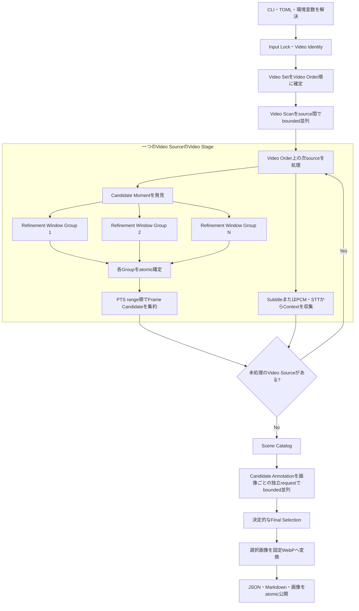

# Pipeline処理フローと計算資源

動画入力からブログ用画像を公開するまでの大まかな順序と、各処理が主に使う計算資源を示します。checkpointの詳細と中断後の再開範囲は[Pipelineと安全な再開](pipeline-resume.md)を参照してください。

## 処理フロー

Refinement Window Groupは互いに意味状態を共有しない範囲だけを並列化します。worker数はGroup数、最大4、available memory、Video Scanと共有するlogical CPU予算の最小値です。次にVideo Orderで処理するsourceのRefinement容量は、そのscan完了を待つ前に要求します。このためscan完了境界では後続scanの補充より最低1 Refinement worker分を優先し、後からVideo Scan Controllerが増員しても、両方の予約合計がlogical CPU数を超える新規scanを投入しません。active scanだけで余力がない場合はscan完了を待ち、1 worker分を確保してからRefinementを開始します。待機中にbackground scanが失敗した場合は、新しいRefinementを開始せず同じ失敗を返します。RGB frame数は最低240fpsの保守値と、Video Scanで全native frameから実測した最小PTS差・同一PTS最大frame数による上限の大きい方で見積もります。旧cacheなどで完全なframe timing hintを取得できない場合、available memoryを取得できない場合、または一Groupもparallel memory予算へ収まらない場合は従来の1 workerへ戻します。Groupの開始順や完了順ではなくPTS range順に戻してから親Stageへ集約するため、CPU数、memory量、再開の有無はCandidate ID、画像bytes、下流選定を変えません。

## 主に使う計算資源

| 処理 | 主な資源 | GPUとの関係 | 並列・再開境界 |
|---|---|---|---|
| Video IdentityのSHA-256 | HDD/SSD、CPU | GPUへ移せない | 動画1本ごと |
| Video Scan | disk、FFmpeg decode、CPU。設定時はNVDEC | `nvdec`選択時だけNVIDIA Decoderを使う | source間の動的worker、15分PTS partition |
| Refinement Window Group | disk、FFmpeg software range decode、CPU、RGB frame memory、OpenCV/NumPy | OllamaやGPU推論を使わない | Video Scanとの共有CPU・available memoryに応じて最大4 Group、Groupごと |
| Subtitle・PCM抽出 | disk、FFmpeg、CPU | 通常はGPUを使わない | subtitle stream、PCM sample rangeごと |
| STT | disk、CPU、設定されたSpeech Runtime | CUDA設定時はGPUを使える | PCM chunkごと |
| Scene Catalog・Candidate Annotation | Ollama、GPU/VRAM | 主なGPU推論 | model requestまたは評価画像1枚ごと |
| Final Selection | CPU、memory | GPUを使わない | Video Setごと |
| WebP公開 | disk、CPU encode | GPUを使わない | 選択画像1枚ごと |

Refinementの並列度を増やしてもOllamaのGPU使用率は上がりません。この区間はCPUとdiskの余力を使ってFresh Processingを短縮するための境界です。Ollamaの並列上限とは独立しており、どちらのworker数もsemantic fingerprintへ含めません。
